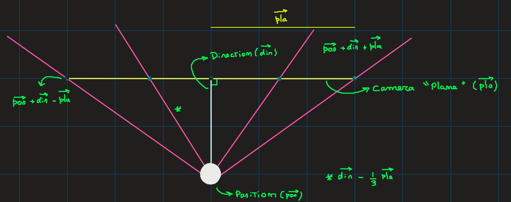
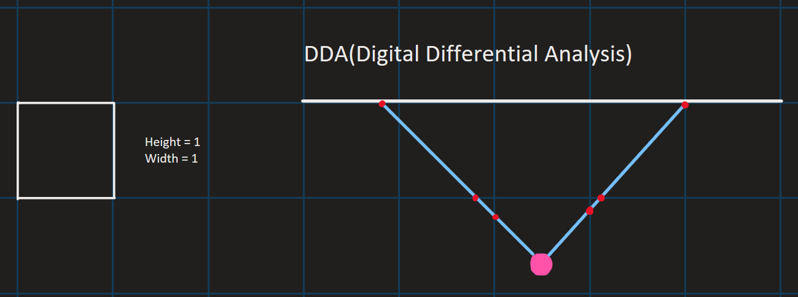
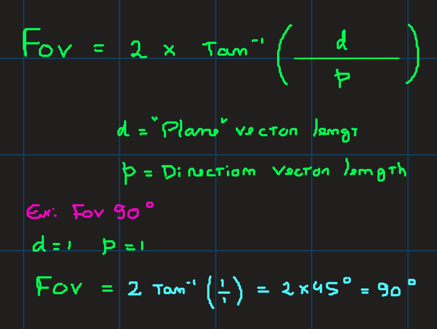
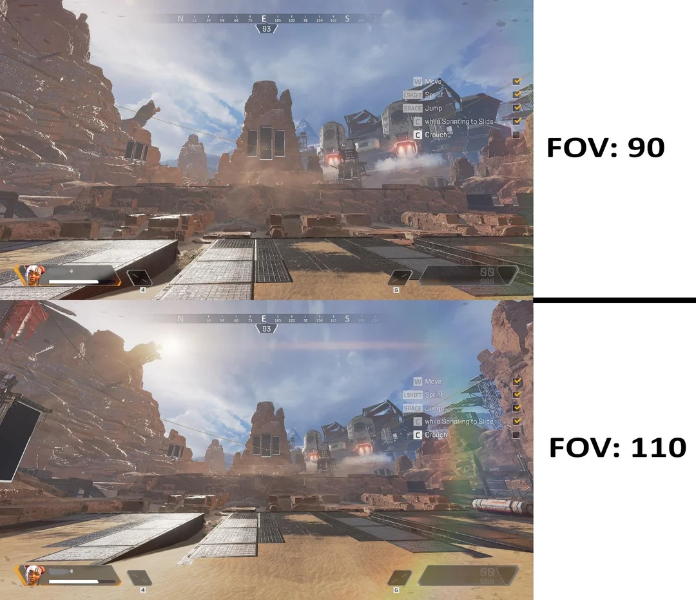
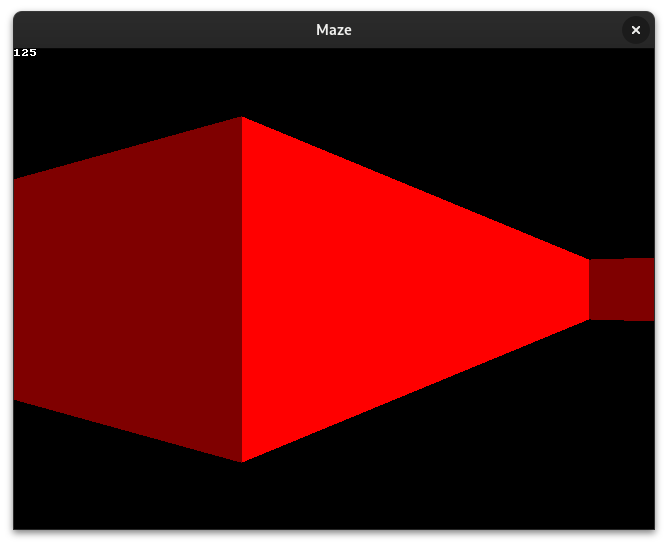

# Maze

## How does ray casting work?
The map is a 2D square grid, and each square can either be 0 (no wall), or a positive value (a wall with a certain colour or texture).

There are three main components:

- The player represented as a vector (x and y coordinates).

- The player's direction is represented as a vector (x and y coordinates).

- A camera plane, which represents the surface of the computer screen and is represented by a line (a single vector) that should always be perpendicular to the direction vector.

## Components representation

- The ***white ball*** represents the player (vector "pos")
- The ***white ray*** represents the player's direction (vector "dir")
- The ***yellow line*** represents the camera "plane". (I will use quotes around "plane" because ray casting occurs on a 2D map, so the plane is essentially just a line. However, for clarity, I will refer to it as the camera plane, even though this terminology isn’t entirely accurate.)

## DDA(Digital Differential Analysis)

We used **Digital Differential Analysis (DDA)** to find which squares of the map the ray hits and stop the algorithm once a square that is a wall is hit.

## FOV (Field Of Vision)
The FOV is determinated by the ratio of the length of the direction vector, and the length of the plane
### Example: 

***And in this example it becomes clearer what the FOV is in practice, roughly speaking, the larger the FOV, the larger your field of view will be.***
 

## How does Maze generation work?
...
...
...

## Final result

