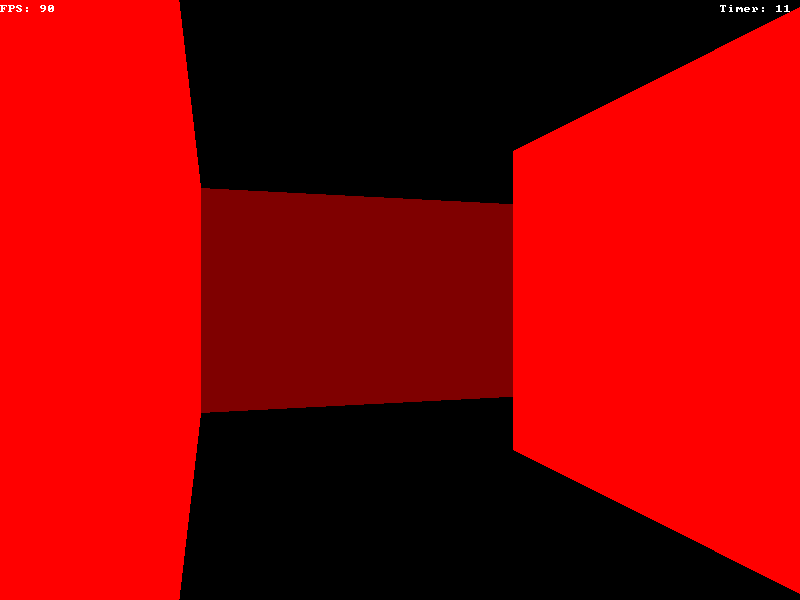
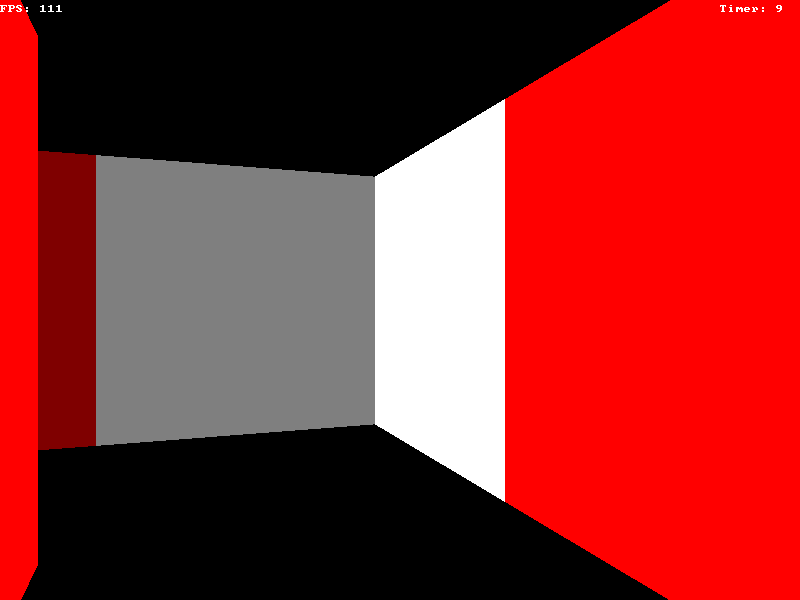
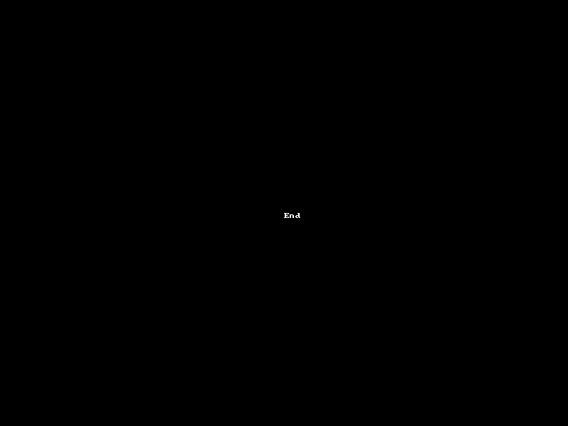

# Maze

## How does ray casting work?
The map is a 2D square grid, and each square can either be 0 (no wall), or a positive value (a wall with a certain colour).

There are three main components:

- The player

- The player's direction

- The camera plane


## Components representation

- The `white ball` represents the player (vector "pos")
- The `white ray` represents the player's direction (vector "dir")
- The `yellow line` represents the camera "plane"


## Player movement
When the `player rotates`, the camera has to rotate, so both the direction vector and the plane vector have to be rotated.
```
// Player movement
readKeys();
if (keyDown(SDLK_UP)){
if(worldMap[int(posX + dirX * moveSpeed)][int(posY)] == false) posX += dirX * moveSpeed;
if(worldMap[int(posX)][int(posY + dirY * moveSpeed)] == false) posY += dirY * moveSpeed;

}

// Move backwards
if (keyDown(SDLK_DOWN)){
if(worldMap[int(posX - dirX * moveSpeed)][int(posY)] == false) posX -= dirX * moveSpeed;
if(worldMap[int(posX)][int(posY - dirY * moveSpeed)] == false) posY -= dirY * moveSpeed;
}

// Rotate to the right
if (keyDown(SDLK_RIGHT)){
double oldDirX = dirX;
dirX = dirX * cos(-rotSpeed) - dirY * sin(-rotSpeed);
dirY = oldDirX * sin(-rotSpeed) + dirY * cos(-rotSpeed);
double oldPlaneX = planeX;
planeX = planeX * cos(-rotSpeed) - planeY * sin(-rotSpeed);
planeY = oldPlaneX * sin(-rotSpeed) + planeY * cos(-rotSpeed);
}

// Rotate to the left
if (keyDown(SDLK_LEFT)){
double oldDirX = dirX;
dirX = dirX * cos(rotSpeed) - dirY * sin(rotSpeed);
dirY = oldDirX * sin(rotSpeed) + dirY * cos(rotSpeed);
double oldPlaneX = planeX;
planeX = planeX * cos(rotSpeed) - planeY * sin(rotSpeed);
planeY = oldPlaneX * sin(rotSpeed) + planeY * cos(rotSpeed);
}
```

## How does Maze generation work?
The maze is generated using a Depth-First Search (DFS) algorithm.
1. **Initialization**: All cells are initially set as walls (1):
```
for(int y = 0; y < mapHeight; ++y){
    for(int x = 0; x < mapWidth; ++x){
        maze[y][x] = 1;
    }
}
```
2. **Starting Point**: The maze generation starts from a predefined cell:
```
carveMaze(maze, 1, 1);
```
3. **DFS Maze Generation**
```
void carveMaze(int (&maze)[mapHeight][mapWidth], int x, int y){
    int directions[4][2] = {{2,0}, {-2,0}, {0,2}, {0,-2}};

    maze[y][x] = 0;

    std::random_device rd;
    std::mt19937 g(rd());
    std::shuffle(std::begin(directions), std::end(directions), g);
    
    for(auto const* direction : directions){
        int dx = direction[0];
        int dy = direction[1];
        int nx = x + dx;
        int ny = y + dy;
        
        if(isInside(nx, ny) && maze[ny][nx] == 1){
            maze[y + dy/2][x + dx/2] = 0;
            carveMaze(maze, nx, ny);
        }
    }
}
```

# Final Result



